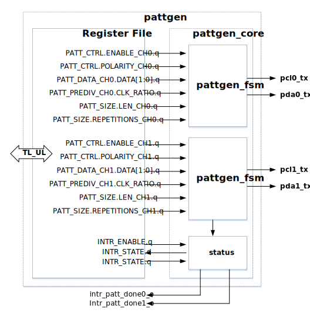

# Overview 

This document specifies PATTGEN hardware IP (HWIP) functionality.
This module conforms to the [Comportable guideline for peripheral functionality.]()
See that document for integration overview within the broader top-level system.

## Features

- Generates time-dependent patterns on two (2) channels, each with its own clock.
-    In each channel, data is transmitted serially on a one-bit data (pda) output, which is synchronous to a corresponding parallel clock signal (pcl).
   -    The channels may operate independently or synchronously with each other. 
- Each output channel supports the following configuration registers:
    -	Pattern data per output (2-64 bits of data).
    -	Pattern length per output (2-64 bits).        
    -	32-bit pre-divider to derive pattern clock from I/O clock (minimum value: 2).
    -	A 10-bit repeat counter
    -   A bit control the polarity of the clock signal 
- Sends interrupt on pattern completion.
    
## Description 

The PATTGEN IP transmits short (maximum 64 bits) time-dependent data patterns on two clock-parallel  channels.
Each Channel consists of one clock (`pcl`) and one data (`pda`) line.
The output channels may be activated and operated independently, or they can be started at the same time to effectively create a 4-output pattern.
 
## Compatibility

This IP block does not have any direct hardware compatibility requirements.

# Theory of Operations 

To start pattern generation, the registers interface of PATTGEN HWIP should be properly initialized and configured.
To configure a single channel:
1. Before configuration, desable the desired channel by clearing the corresponding enable bit: ( for Channel 0,  for Channel 1).
1. Set the polarity bit ( for Channel 0,  for Channel 1) to determine the desired clock phase.
For either channel, a zero in the polarity bit indicates that the channel clock line (`pcl`) should start low, and the channel data line `pda` transition on every falling edge of `pcl`.
A one in the polarity bit inverts the `pcl` clock so that it starts high and `pda` transitions on the rising edge.

{signal: [
  {name: 'PATT_CTRL.ENABLE_CH0', wave: 'lh......'},
  {name: 'PATT_CTRL.POLARITY_CH0 (default: low)', wave: '0.......'},
  {name: 'pcl0_tx', wave: '0.hlhlhl'},
  {name: 'pda0_tx', wave: 'x3.3.3.3', data: 'DATA[0] DATA[1] DATA[2]'},
  {name: 'PATT_CTRL.POLARITY_CH1 (high)', wave: '1.......'},
  {name: 'pcl1_tx', wave: '1.lhlhlh'},
  {name: 'pda1_tx', wave: 'x5.5.5.5', data: 'DATA[0] DATA[1] DATA[2]'},
  
],
  head: {text: 'Effect of the Polarity Registers',tick:0}}


1. Program the seed patterns (1-64 bits in length) using the muli-registers  (for Channel 0) or  (for Channel 1).
For either channel, the first 32 bits to be transmitted, are programmed in the lower half of the multi-register (e.g. ), and the latter 32 bits are programmed in the upper half of multi-register (e.g. ).
1. Program the clock divider ratios to the approprpriate registers,  for Channel 0 or  for Channel 1.
The resuling clock frequency will be slower than the input I/O clock by a ratio of 2&times;(CLK_RATIO+1):
$$f_{pclx}=\frac{f_\textrm{I/O clk}}{2(\textrm{CLK_RATIO}+1)}$$
1. Program the length of seed pattern using one of the fields , for Channel 0. or  for Channel 1.
Note that since the allowed seed length ranges from 1-64, the value of this field should be one less than the pattern length.
For example, to generate an 16-bit pattern on Channel 1, a value of 15 should written to the field . 
1. Program the desired number of pattern repetitions using one of the fields  for Channel 0, or   for channel 1.
Note that since the allowed number of pattern repetitions ranges from 1-1024, the value of this field should be one less than the desired repetition count.
For example, to repeat a pattern 30 times on Channel 1, a value of 29 should written to the field . 
1. Finally to start the pattern, set the  to enable Channel 0 or set  to enable Channel 1.
Set both bits simultaneously, to start both channel patterns at the same time.

The pattern can be halted on either channel by setting the corresponding `PATT_CTRL.ENABLE` bit to 0 for the desired channel.
Note that re-enabling either channels restarts the pattern sequence for that channel from the beginning.

PLease note that writes to a channel's configuration registers have no effect while a pattern is running on that channel.
For operational simplicity, the configuration registers are only transferred into the internal finite state machines while a channel is disabled.
Changes to the configuration registers only take effect once the channel has been disabled and re-enabled.

## Block Diagram

## Hardware Interfaces



## Design Details 

The design consists of two identical, and independent finite state machines, each an instance of module `pattgen_fsm`).
Each FSM is essentially three nested counters, with one counter to control the clock division, another to count out the sequence bits, and a third to keep count of the number of repetitions.

Each FSM consists of.
- Inputs::
    - `clk_io`, `reset`, `enable`, `clk_pre_divide`, `pattern`, `pattern_size`, `polarity`,  and `n_repeats`
- Outputs:
    - `pda` and `pcl`
- a single state variable with three states `IDLE`, `ACTIVE`, and `END`,.
- a clock-divide counter, `clk_div`. a single clock-divide flop, `clk_int`, and
- two two internal counters `bit_ctr` and `repeat_ctr`

Each FSM is disabled when `enable` is low.
Disabling the FSM is equivalent to reset, and both operations place the FSM in the `IDLE` state.
While in `IDLE`, the other state machine registers assume their default states:
The internal counters, the clock-divide, `bit_ctr` and `repeat_ctr` all reset to 0, as does `clk_int`.

Once the FSM is enabled, it transitions to the `ACTIVE` state.  The clock-divide counter `clk_div` increments every cycle, except when it overflows at `clk_pre_divide`.
Then it resets to 0, toggling `clk_int` in the process.
The results in an internal clock frequency of:
$$f_\textsf{clk\_int}=\frac{f_\textsf{clk\_io}}{2\times\textsf{clkPreDivide}}\textrm{ for }x\in{0, 1}$$.

The FSM clock output, `pcl`, is directly driven by `clk_int`, unless the `polarity` input is high, in which case `pcl` is inverted from `clk_int`.

The `bit_ctr` counter increments on every falling edge of `clk_int`, until it overflows at the pattern length based on the `pattern_size` input.

In the `ACTIVE` state, the FSM `pda` output is driven by a multiplexor, connected to the `pattern` input.
The value of `bit_ctr` selects the bit value from the appropriate sequence position, via this multiplexor.

Finally whevever `bit_ctr` overflows and reverts to zero, the `repeat_ctr` increments, and the pattern starts again.
Finally `repeat_ctr` overflows to zero as it reaches the input value `n_repeats`.
When this overflow occurs, the FSM transitions to the `END` state.
All counters halt, the `pda` data lines reset to zero, and an interupt event is sent out to signal completion.

The entire sequence can be restarted either by resetting or disabling and re-enabling the FSM.

### Interrupts

PATTGEN HWIP provides two interrupt pins, `patt_done0` and `patt_done1`, which 
indicate the completion of pattern generation on the output channels. 
These interrupts can be enabled/disabled by setting/un-setting the corresponding 
bits of `intr_enable` register. To clear the interrupts, 
bit `1` must be written the corresponding bits of `intr_state` register

# Programmers guide

## Initialization

After reset and enabling, the initialization of the PATTGEN HWIP primarily consists of 4 steps:
1. Disabling the PATTGEN functionality, for the desired channels,
1. intializating the control registers,
1. configuring the interrupts, and
1. enabling the PATTGEN functionality for the desired channels.

## Register Table 

