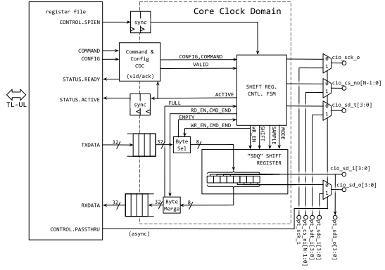

# Overview

This document specifies SPI_HOST hardware IP (HWIP) functionality.
This module conforms to the [Comportable guideline for peripheral functionality.]()
See that document for integration overview within the broader top-level system.

## Features

- Hardware control for remote devices using the Serial Peripheral Interface (SPI)
- Primarily designed for serial NOR flash devices such as the [Winbond W25Q01JV](https://www.winbond.com/resource-files/W25Q01JV%20SPI%20RevB%2011132019.pdf)
- Number of chip select lines controlled by `NumCS` parameter
- Support for Standard SPI, Dual SPI or Quad SPI commands
  - Signals SD[0] through SD[3] are intended to connect to lines IO0 through IO3 respectively, on the target device.
  - Signal SD[0] may also be identified as "MOSI" by other SPI Hosts, while SD[1] is commonly referred to as "MISO"
- RX and TX data held in separate FIFOs
   - 288 bytes for TX data, 256 bytes for RX data
   - FIFOs loaded/unloaded via 32-bit TL-UL registers
   - Support for arbitrary byte-count in each transaction
   - Parametrizable support for Big- or Little-Endian systems in ordering I/O bytes within 32-bit words.
- SPI clock rate controlled by separate input clock to core
   - SPI SCK line typically toggles at 1/2 the core clock frequency
   - An additional clock rate divider exists to reduce the frequency if needed
- Support for all SPI polarity and phases (CPOL, CPHA)
   - Additional support for "Full-cycle" SPI transactions, wherein data can be read a full SPI Clock cycle after the active edge (as opposed to one half cycle as is typical for SPI interfaces)
- Single Transfer Rate (STR) only (i.e. data received on multiple lines, but only on one clock edge)
   - *No support* for Dual Transfer Rate (DTR)
- Pass-through mode for coordination with [SPI_DEVICE IP]()
- Automatic control of chip select lines
- Condensed interrupt footprint: Two lines for two distinct interrupt classes: "error" and "spi_event"
   - Fine-grain interrupt masking supplied by secondary enable registers

## Description

The Serial Peripheral Interface (SPI) is a synchronous serial interface quite commonly used for NOR flash devices as well as a number of other off-chip peripherals such as ADC's, DAC's, or temperature sensors.
The interface is a *de facto* standard (not a formal one), and so there is no definitive reference describing the interface, or establishing compliance criteria.

It is therefore important to consult the data sheets for the desired peripheral devices in order to ensure compatibility.
For instance, this OpenTitan SPI Host IP is primarily designed for controlling Quad SPI NOR flash devices, such as the [W25Q01JV Serial NOR flash from Winbond](https://www.winbond.com/resource-files/W25Q01JV%20SPI%20RevB%2011132019.pdf) or this [1 Gb M25QL NOR flash from Micron](https://media-www.micron.com/-/media/client/global/documents/products/data-sheet/nor-flash/serial-nor/mt25q/die-rev-b/mt25q_qlkt_l_01g_bbb_0.pdf?rev=43d124f03bbf4ef0962435e9ec63a185).
Though this IP implementation aims to be general enough to support a variety of devices, the Winbond serial flash device is used as the primary reference for understanding our host requirements.

There are also a number of good references describing legacy host implementations for this protocol, which are useful for understanding some of the general needs for a wider range of target devices.
For instance, the legacy [SPI Block Guide](https://web.archive.org/web/20150413003534/http://www.ee.nmt.edu/~teare/ee308l/datasheets/S12SPIV3.pdf) from Motorola contains a definitive overview of some of the the general requirements for a standard SPI host, notably the definitions of SPI clock phase and polarity (CPOL and CPHA).
In order to potentially support a broad range of devices, this SPI Host IP also supports all four of the standard SPI clock phases.

### SPI Protocol Basics

Broadly speaking, the SPI host accepts commands from the TL-UL interface and, based on these commands, serially transmits and receives data on the external SPI interface pins.
The timing and data-line formatting of the command sequence depend on the external peripheral device and the nature of the specific command issued.

In each standard SPI command a number of instruction-, address- or data-bytes are transmitted on SD[0], and response bytes are received on SD[1].
So in standard-mode commands, SD[0] is always configured as an output, and SD[1] is always an input.
In standard SPI commands the SD[0] and SD[1] lines can be used as a full-duplex communication channel.
Not all devices exploit this capability, opting instead to have clear input and output phases for each command.
This half-duplex signaling behavior is especially common in devices with also support Dual- and Quad-mode commands, which are always half-duplex.
The SPI_HOST IP optionally supports both full-duplex and half-duplex commands in standard mode.

Along with the data lines, the SPI protocol also includes a chip select line, commonly called CS\#.
In this IP we refer to it as CSB.
The SPI bus can be connected to many target peripherals, but each device on the bus gets its own chip select line, and so this active-low signal designates a particular device for each command.

The chip-select line also marks the beginning and end of each command.
No device will accept any command input until CSB has been asserted for that device, and most devices (if not all) do not accept a second command unless CSB has been deasserted to mark the end of the previous command.
Some simple devices, particularly those that support SPI daisy-chaining, do not process command input at all until *after* the CSB line has been deasserted.
In the case of NOR flash devices, read and write commands are indeterminate in length, and the data transfer ends only when the CSB line is deasserted.
So, though the exact details of operation may vary from device to device, the edges of the CSB signal serve as an important markers for delineating the boundaries of each transaction.

The SD and CSB lines are accompanied by a serial clock, SCK.
The host is responsible for generating the serial clock, and typically each side asserts outgoing data on one edge of the clock (e.g. on the rising edge) and samples data in the next edge (e.g. on the falling edge).
When it comes to devices there is no universal convention on clock polarity (CPOL) or clock phase (CPHA).
Some devices expect the clock line to be low when the host is idle, thus the clock should come as a sequence of positive pulses (CPOL = 0).
On the other hand, other devices expect CPOL = 1, meaning that the clock line is inverted: *high* when idle with sequences of *negative* pulses.

Devices also differ in their expectations of clock *phase* (CPHA) relative to the data.
Devices with CPHA = 0, expect that both the host and device will be sampling data on the *leading* edge, and asserting data on the *trailing* edge.
(Because of the option for either polarity, the terms "leading" and "trailing" are preferred to "rising" or "falling").
When CPHA = 0, the first output bit is asserted with the falling edge of CSB.
Meanwhile if CPHA = 1, data is always is asserted on the leading edge of SCK, and data is always sampled on the trailing edge of SCK.

When operating at the fastest-rated clock speeds, some flash devices (i.e. both the Winbond and Micron devices noted above), require setup times which exceed half a clock-cycle.
In order to support these fastest data rates, the SPI_HOST IP offers a modified "Full-cycle" (FULLCYC = 1) timing mode where data can be sampled a *full* cycle after the target device asserts data on the SD bus.
This full cycle mode has no effect on any of the signals transmitted, only on the timing of the sampling of the incoming signals.


{signal: [
  {name: "clk_core_i", wave: "p.................."},
  {name: "SCK (CPOL=0)", wave: "0.1010101010101010."},
  {name: "SCK (CPOL=1)", wave: "1.0101010101010101."},
  {name: "CSB", wave: "10................1"},
  ["CPHA = 0",
    {name: "SD[0] (output)", wave: "22.2.2.2.2.2.2.2...", data: ["","out7", "out6", "out5", "out4", "out3", "out2", "out1", "out0" ]},
    {name: "SD[1] (input)", wave: "22.2.2.2.2.2.2.2.2.", data: ["","in7", "in6", "in5", "in4", "in3", "in2", "in1", "in0",""]},
    {name: "Sampling event (FULLCYC=0)", wave: "1.H.H.H.H.H.H.H.H.."},
    {name: "Sampling event (FULLCYC=1)", wave: "1..H.H.H.H.H.H.H.H."},
  ],
  ["CPHA = 1",
    {name: "SD[0] (output)", wave: "2.2.2.2.2.2.2.2.2..", data: ["","out7", "out6", "out5", "out4", "out3", "out2", "out1", "out0" ]},
    {name: "SD[1] (input)", wave: "2.2.2.2.2.2.2.2.2.2", data: ["","in7", "in6", "in5", "in4", "in3", "in2", "in1", "in0",""]},
    {name: "Sampling event (FULLCYC=0)", wave: "1..H.H.H.H.H.H.H.H."},
    {name: "Sampling event (FULLCYC=1)", wave: "1...H.H.H.H.H.H.H.H"},
  ],
],
  head: {
    text: "Standard SPI transaction (1 byte), illustrating of the impact of the CPOL, CPHA, and FULLCYC settings"
  },
  foot: {
  }
}


As mentioned earlier, the SD[0] and SD[1] lines are unidirectional in Standard SPI mode.
On the other hand in the faster Dual- or Quad-modes, all data lines are bidirectional, and in Quad mode the number of data lines increases to four.
For the purposes of this IP, Dual or Quad-mode commands can be thought of as consisting of up to four command *segments* in which the host:
1. Transmits instructions or data at single-line rate,
2. Transmits instructions address or data on 2 or 4 data lines,
3. Holds the bus in a high-impedance state for some number of "dummy" clock cycles (neither side transmits), or
4. Receives information from the target device.

Each of these segments have a different directionality or speed (i.e., SD bus width).
As indicated in the example figure below, input data need only be sampled during the last segment.
Likewise, software-provided data is only transmitted in the first two segments.
The SPI_HOST command interface allows the user to specify any number of command segments to build larger, more complex transactions.


{signal: [
  {name: "clk_core_i", wave: "p................................"},
  {name: "SCK (CPOL=0)", wave: "0.101010101010101010101010101010."},
  {name: "CSB", wave: "10..............................1"},
  {name: "SD[0]", wave: "22.2.2.2.2.2.2.2.2.2.z.....2.2.x.", data: ["","cmd7", "cmd6", "cmd5", "cmd4", "cmd3", "cmd2", "cmd1", "cmd0",
                                                             "out4", "out0", "in4", "in0" ]},
  {name: "SD[1]", wave: "z................2.2.z.....2.2.x.", data: ["out5", "out1", "in5", "in1"]},
  {name: "SD[2]", wave: "z................2.2.z.....2.2.x.", data: ["out6", "out2", "in6", "in2"]},
  {name: "SD[3]", wave: "z................2.2.z.....2.2.x.", data: ["out7", "out3", "in7", "in3"]},
  {name: "Segment number", wave: "x2...............3...4.....5...x.", data: ['1', '2', '3','4'] },
  {name: "Segment speed", wave: "x2...............3...4.....5...x.", data: ['Standard', 'Quad', 'X', 'Quad'] },
  {name: "Segment direction", wave: "x2...............3...4.....5...x.", data: ['TX', 'TX', 'None', 'RX'] },
  {name: "Sampling event (FULLCYC=0)", wave: "1...........................H.H.."},
  {name: "Sampling event (FULLCYC=1)", wave: "1............................H.H."},
],
  head: {
  text: "Example Quad SPI transaction: 1 byte TX (Single), 1 byte (Quad), 3 dummy cycles and 1 RX byte with CPHA=0"
  },
}


For even faster transfer rates, some flash chips support double transfer rate (DTR) variations to the SPI protocol wherein the device receives and transmits fresh data on *both* the leading and trailing edge.
This IP only supports single transfer rate (STR), *not* DTR.
A preliminary investigation of DTR transfer mode suggests that proper support for setup and hold times in this mode may require a level of sub-cycle timing control which is not currently planned for this IP.

# Theory of Operations

## SPI_HOST IP Command Interface

A SPI command consists of at least one segment. Each segment has a different speed (number of active SD lines), direction and length.
For example a Quad SPI read transaction consists of 4 segments:
1. A single byte instruction transmitted at *standard* data rate
2. A three or four byte address transmitted at *quad* data rate
3. A number of dummy cycles (no data transmitted or received)
4. The desired data, received by SPI_HOST at *Quad* data rate

During a transaction, software can issue multiple segment descriptions to the SPI_HOST IP to control for changes in speed or direction.

Issuing a command then consists of the following steps:
1. Configure the IP to be compatible with each attached peripheral.
The  multi-register holds separate sets of configuration settings, one for each CSB line.
In principle, the configuration of these device-specific options only needs to be done/performed once at initialization.

2. Load the TX FIFO with the instructions and data to be transmitted to the remote device by writing to the  memory window.
3. Specify which device should receive the next command using the  register.
4. Wait for  before continuing.
5. Issue speed, direction, and length details for the next command segment using the  register.
If a command consists of multiple segments, then set  (Chip-select active after transaction) to one for all segments except the last one.
Setting  to zero indicates the end of a transaction, prompting the IP to raise CSB at the end of the segment.

6. Repeat steps 4 and 5 until all segments have been described.
7. Read any peripheral response data from the RX FIFO by reading from the  memory window.

### About Command Segments

The structure of a SPI command depends on the device and the command itself.

To support a variety of different I/O sequences the SPI_HOST FSM treats each command as a sequence of segments, each with a defined length, direction and speed.

In case of a standard SPI device the commands are very consistent in structure: the host transmits data on SD[0], and always receives data on SD[1].
For such devices, all commands can in principle be treated as bidirectional, as both the host and device are always transmitting on their respective lines.
For bidirectional commands, the SPI_HOST IP will store one byte in the RX FIFO for each byte transmitted from the TX FIFO.

However, even for these standard SPI commands, software may be uninterested in some or all of the device's response data.
For example, for SPI flash devices, standard-mode write commands contain no useful data in the device response, even though the device may be actively asserting signals to SD[1] throughout the transaction.
Therefore, for such commands software may choose to specify the entire command as "TX Only", in which case data placed in the TX FIFO will be transmitted throughout the write command, but signals received from the device will be ignored and will not fill the RX FIFO.

Meanwhile for other flash commands, such as standard-mode read, the device only transmits useful information during some portions of the transaction.
In the case of a basic read (with a 3-byte address), the instruction starts with a 1-byte instruction code (0x3) followed by the three address bytes, during which time the flash device outputs may be high impedance (depending on the device).
The device then immediately responds with the requested data in the next SCK cycle, and continues to output data bytes until the CSB line is deasserted.
Though such a command could also be treated as entirely bidirectional, the device response can be safely ignored during the instruction and address phase, especially if the SD[1] line is high impedance during this time.
Likewise it is not necessary for software to specify any data to transmit while the device is responding.
Therefore such a command can be thought of as consisting of two separate segments, the first segment being TX Only and the second segment being RX only, as shown in the following figure.
Breaking the command up this way potentially simplifies the job of writing software for this type of command.


{signal: [
  {name: "clk_core_i",     wave: "p....................|.............."},
  {name: "SCK (CPOL=0)",   wave: "0.1010101010101010101|01010101010101"},
  {name: "CSB",            wave: "10...................|.............."},
  {name: "SD[0]",          wave: "00.0.0.0.0.0.1.1.2.2.|2.2.x.........", data: ["a[23]", "a[22]", "a[1]", "a[0]"]},
  {name: "SD[1]",          wave: "z....................|....2.2.2.2.2.", data: ["d[7]", "d[6]", "d[5]", "d[4]", "..."]},
  {name: "Segment number", wave: "x2...................|....2.........", data: ['1', '2', '3','4'] },
  {name: "Segment speed",  wave: "x2...................|....2.........", data: ['Standard', 'Standard'] },
  {name: "Segment direction", wave: "x2...................|....2.........", data: ['TX', 'RX', 'None', 'RX'] },
  ],
 foot: {text: "Standard SPI example: Flash Read command with 24-bit address, consisting of one TX and one RX segment"}
}


In addition to the TX, RX or Bidirectional modes, many SPI commands require periods where neither the host or device are transmitting data.
For instance, many flash devices define a Fast Read command in which the host must insert a number of "dummy clocks" between the last address byte and the first data byte from the device.
These extra cycles are required for operation at higher clock frequencies, to give the address time to propagate through the flash core.
A standard-mode Fast Read (with 3 byte addressing) command then requires *three* SPI_HOST command segments:
- 4 bytes TX Only: one for the instruction code (i.e., 0xb for Fast Read), and three for the address.
- 8 dummy clocks
- N bytes RX Only for read data response


{signal: [
  {name: "clk_core_i",     wave: "p....................|.............................."},
  {name: "SCK (CPOL=0)",   wave: "0.1010101010101010101|010101010101010101010101010101"},
  {name: "CSB",            wave: "10...................|.............................."},
  {name: "SD[0]",          wave: "00.0.0.0.1.0.1.1.2.2.|2.2.x.........................", data: ["a[23]", "a[22]", "a[1]", "a[0]"]},
  {name: "SD[1]",          wave: "z....................|....z.z.z.z.z.z.z.z.2.2.2.2.2.", data: ["d[7]", "d[6]", "d[5]", "d[4]", "..."]},
  {name: "Segment number", wave: "x3...................|....4...............5.........", data: ['1', '2', '3'] },
  {name: "Segment speed",  wave: "x3...................|....4...............5.........", data: ['Standard', 'X', 'Standard'] },
  {name: "Segment direction", wave: "x3...................|....4...............5.........", data: ['TX', 'Dummy', 'RX'] },
  ],
 foot: {text: "Standard SPI example: Fast read command (instruction code 0xb) with 24-bit address, consisting of three segments, one TX, 8 dummy clocks and one RX segment"}
}


For standard mode-commands, segments simplify the IO process by identifying which bus cycles have useful RX or TX data.
In such cases it is not strictly necessary to the manage the impedance of the SD[0] and SD[1] lines.
For Dual- and Quad-mode commands, however, impedance control necessary.
The impedance of all data lines (SD[3:0]) must switch between TX and RX segments.

Bidirectional data transfers are not applicable for Dual- or Quad-mode segments.

In addition, the speed-mode changes how data is distributed across the four data lines, and many commands require that some segments are transmitted in standard mode (only on SD[0]), while the bulk of the data is transmitted in Dual- or Quad-mode.
For this reason the speed-mode is also adjustable on a segment-by-segment basis.

#### Specifying Command Segments

The SPI host supports all four possible modes for command segments, and they are controlled writing one of the following values to the 2-bit  register:
- 2'b00: Dummy cycles only (neither side transmits)
- 2'b01: RX Only
- 2'b10: TX Only
- 2'b11: Bidirectional

### CSID Register

The  register is used to identify the target device for the next command segment.
Whenever a command segment descriptor is written to ,  is passed into the FSM along with the command segment descriptor and the corresponding configurations options (taken from the CSID'th element of the `CONFIGOPTS` multi-register).

This register still exists when instantiated with only one CSB line (i.e. when NumCS=1).
However in this case the  value is ignored.

Changes in  also affect the CSB lines, because a change in CSID can also implicitly end a command, overriding .
If a change is detected in , but the previous segment was submitted with the `CSAAT` bit asserted, the FSM terminates the previous command before moving on to the next segment.
The previous CSB line is held low for *at least* `CSNTRAIL` cycles (as defined by the previous value of ) and then brought high.
All CSB lines are held high for `CSNIDLE` cycles (using the new value of ).
The new CSB line is asserted low, and SCK begins toggling after the usual `CSNLEAD` cycle delay.

### Configuration Options

The  multi-register has one entry per CSB line and holds clock configuration and timing settings which are specific to each peripheral.
Once the  multi-register has been programmed for each SPI peripheral device, the values can be left unchanged.

The following sections give details on how the SPI_HOST can be used to control a specific peripheral.
For simplicity, this section describes how to interact one device, attached to CSB[0], and as such references are made to the multi-registers  and .
To configure timing and send commands to devices on other CSB lines, instead use the `CONFIGOPTS` multi-register corresponding to desired CSB line.

The most common differences between target devices are the requirements for a specific SPI clock phase or polarity, CPOL and CPHA, which were described in the previous section [SPI Protocol Basics](#spi-protocol-basics).
These clock parameters can be set via the  or  register fields.
Likewise, as also described in the previous section, if device setup times require a full clock cycle before sampling the output, Full-Cycle Mode can be enabled by asserting the  bit.

#### Clock rate selection

The SPI clock rate for each peripheral is set by two factors:
- The SPI_HOST core clock (which may be generated independently from the TL-UL interface clock)
- An additional 16-bit clock divider

The SPI protocol usually requires activity (either sampling or asserting data) on either edge of the SCK clock.
For this reason the maximum SCK frequency is at most one half the SPI_HOST core frequency.
In order to support a broader range of SPI clock frequencies, the SPI_HOST core operates on a separate clock domain, which may be independent from the TL-UL bus clock.
This arrangement allows gives more flexibility in setting the serial clock frequency by means of an external PLL, and in principle the SCK frequency could even be configured to *exceed* the bus clock.
For example, if the TL-UL bus is operating at 100MHz, a 200MHz SPI core clock can be fed to the SPI_HOST IP, in order to achieve data rates of 100 MTransfers/s (near the maximum clock rate of the Winbond flash device).

Since some peripheral devices attached to the same SPI_HOST may require different clock frequencies, there is also the option to divide the core clock by an additional factor when dealing with slower peripherals.

$$T_\textrm{\textrm{SCK},0}=\frac{1}{2}\frac{T_\textrm{core}}{\textrm{CONFIGOPTS_0.CLKDIV}+1}$$

Alternatively, this clock-divide feature can also be used to entirely bypass the need for an independent core clock.
Instead the core can be driven by the TL-UL bus clock, and the SCK period can be adjusted using the  setting.

#### Chip-select timing control

Typically the CSB line is automatically deasserted after the last edge of SCK.
However,  by asserting  when issuing a particular command, one can instruct the core to hold CSB low indefinitely after the last clock edge.
This is useful for merging two adjacent commands together, to create very long commands such as continuous read operations.
The CSB line can then be deasserted by either issuing another command without the  field, issuing a command to a different device (after changing the a  register), or simply resetting the core FSM via the  register.

Most devices require at least one-half SCK clock-cycle between either edge of CSB and the nearest SCK edge.
However, some devices may require more timing margin and so the SPI_HOST core offers some configuration registers for controlling the timing of the CSB edges when operating under automatic control.
The relevant parameters are as follows:
- TIDLE: The minimum time between each rising edge of CSB and the following falling edge.
This time delay is a half SCK cycle by default but can be extended to as long as eight SCK cycles by setting the  register.
- TLEAD: The minimum time between each falling edge of CSB and the first leading edge of SCK.
This time delay is a half SCK cycle by default but can be extended to as long as eight SCK cycles by setting the  register.
- TTRAIL: The minimum time between the last trailing edge of SCK and the following rising edge of CSB.
This time delay is a half SCK cycle by default but can be extended to as long as eight SCK cycles by setting the  register.


{signal: [
  {name: "SCK",  wave: "l....1010|10........"},
  {name: "CSB", wave: "10.......|.....1...0", node: ".A...B.....C...D...E"}
],
 edge: ["A<->B minimum (CSNLEAD+1)", "C<->D minimum (CSNTRAIL+1)", "D<->E minimum (CSNIDLE+1)"],
  head: {
    text: "Impact of CSNLEAD, CSNTRAIL and CSNIDLE CONFIGOPTS register settings",
    tick: 1
  },
  foot: {
    text: ["tspan", "All ticks are in units of &#xbd;T",
           ["tspan", {'baseline-shift':'sub'}, "SCK"],
          "=&#xbd;T",
           ["tspan", {'baseline-shift':'sub'}, "core"],
          "&#xd7;(CLKDIV+1)"]
  }
}


These settings are all minimum bounds, and delays in the FSM implementation may create more margin in each of these timing constraints.

### Special Command Fields

The  register must be written every time a command is issued.
Whenever a command segment is written to , the contents of the  and  registers are passed through the Config/Command CDC to the SPI_HOST core FSM, along with a Chip Select mask signal, indicating which device should receive the command (for example CSB[0])
Once the command is issued, the core will immediately deassert , and once the command has started  will go high.
The  line takes a few cycles to assert, due to CDC delays.
The command is complete when  goes low.
A `spi_event` interrupt can also be triggered to go off on completion by setting .

### Chip Select Masks

Each instance of the SPI_HOST IP supports a parametrizable number of chip select lines (CSB[NumCS-1:0]).
Each CSB line can be routed either to a single peripheral or to a daisy-chain of peripherals.
Whenever a segment description is written to the  register, the   is sent along with  and the `CONFIGOPTS` multi-register corresponding to   to indicate which device is meant to receive the command.
The SPI_HOST core typically then manages the details of asserting and deasserting the proper CSB line, subject to the timing parameters expressed in , , and .

If [Pass-through mode](#pass-through-mode) is enabled then the CSB lines are controlled by *neither* the SPI_HOST hardware nor the firmware register.
In Pass-though mode, control of the CSB lines passes directly to the inter-module port, `passthrough_i.csb`.

### Back-to-back Segments

The command interface can allows for any number of segments in a given command.

There is no command queue for submitting segments to the SPI_HOST IP.
However a second segment can be placed into the Config/Command CDC whenever  is high, even if the previous segment is still running.
The internal state within the Config/Command CDC provides the option of scheduling a second command segement to execute immediately after completion of the current segment.

On the other hand, writing a segment description to  when  is low will trigger an error condition, which must be acknowledged by software.

## Data Formatting

### Input and Output Byte Ordering

The SPI transactions must be issued with correct bit ordering to properly communicate with a remote device.
Based on the requirements for our chosen flash devices, this IP follows these conventions:
- The relative significance of lines on the SD bus: SD[0] is always the least significant, followed by SD[1] though SD[3] with increasing significance.
- The relative significance of a sequence of bits on the same SD bus: more significant bits are always transmitted before (or at the same time as) less significant bits.
    - For instance, when transferring a single byte in Quad mode, all four bits of the upper nibble (bits 7 through 3) are transferred in the first clock cycle and the entire lower nibble (bits 3 through 0) is transferred in the second cycle.

The programming model for the IP should meanwhile make it easy to quickly program the peripheral device, with a minimum amount of byte shuffling.
It should be intuitive to program the specific flash devices we are targeting, while following the conventions above:
- When reading the data in and out of the  memory window, the IP should fully utilize the TL-UL bus, using 32-bit I/O instructions.
- The SPI_HOST should make it easy to arrange transaction data in processor memory, meaning that bytes should be sequentially transmitted in order of ascending memory address.
  - When using 32-bit I/O instructions, this requires some knowledge of the processor byte-order.

Based on these requirements, data placed in or read from  are handled as follows:
- 32-bit words placed in  are transmitted in first-in-first-out order.
Likewise, words received from the SPI data lines are made available for reading from in  in first-in-first-out order.
- Within a 32-bit word, the `ByteOrder` parameter controls the order in which bytes are transmitted, and also the manner in which received bytes are eventually arranged in the 32-bit  register.
By default (`ByteOrder` = 1, for Little-Endian processors), the LSB of  (i.e bits 7 though 0) is transmitted first, and the other bytes follow in order of increasing significance.
Similarly, the first byte received is packed into the LSB of , and the subsequent bytes read from  are filled in order of increasing significance.

On the other hand, if `ByteOrder` is set to 0 (for Big-Endian processors), the MSB is transmitted first from , and received data is loaded first into the MSB of .
   - The default choice of Little-Endian reflects native byte-order of the Ibex processor.
- Finally *within a given byte*, the most significant bits are transmitted and received first.
For Dual and Quad transactions the least significant bit in any instantaneous pair or nibble is transmitted or received on SD[0], and the remaining SD bits (1 though 3) are populated in order of increasing significance.

The following figure shows how data appears on the serial data bus when it is written to or read from .


 {signal: [
  ["ByteOrder=0",
  {name: "SD[0] (host output)", wave: "x22222222222|2222|222|22x", data: ["t[31]", "t[30]", "t[29]", "t[28]", "t[27]", "t[26]", "t[25]", "t[24]", "t[23]","t[22]",
                                                                          "t[21]","t[17]","t[16]","t[15]","t[14]","t[8]", "t[7]", "t[6]", "t[1]", "t[0]"]},
  {name: "SD[1] (host input)", wave: "x22222222222|2222|222|22x", data: ["r[31]", "r[30]", "r[29]", "r[28]", "r[27]", "r[26]", "r[25]", "r[24]", "r[23]","r[22]",
                                                                         "r[21]","r[17]","r[16]","r[15]","r[14]","r[8]", "r[7]", "r[6]", "r[1]", "r[0]"]},
  {name: "Which byte?", wave: "x4.......4..|..4.|.4.|..x", data: ["DATA MSB", "","", "          LSB"]}
],
  ["ByteOrder=1",
  {name: "SD[0] (host output)", wave: "x22222222222|2222|222|22x", data: ["t[7]", "t[6]", "t[5]", "t[4]", "t[3]", "t[2]", "t[1]", "t[0]", "t[15]","t[14]",
                                                                          "t[13]","t[9]","t[8]","t[23]","t[22]","t[16]", "t[31]", "t[30]", "t[25]", "t[24]"]},
  {name: "SD[1] (host input)", wave: "x22222222222|2222|222|22x", data: ["r[7]", "r[6]", "r[5]", "r[4]", "r[3]", "r[2]", "r[1]", "r[0]", "r[15]","r[14]",
                                                                         "r[13]","r[9]","r[8]","r[23]","r[22]","r[16]", "r[31]", "r[30]", "r[25]", "r[24]"]},
  {name: "Which byte?", wave: "x5.......5..|..5.|.5.|..x", data: ["DATA LSB", "","", "          MSB"]}
],
  ],
  head: {
   text: "Serial bit ordering for 32-bit data words written to DATA (t[31:0]) or read from DATA (r[31:0]) as a Function of the Parameter 'ByteOrder'",
  },
  foot: {
  text: "Standard SPI, bidirectional segment.  Bits are numbered as they appear in the DATA memory window"
  }
}


As shown in the following figure, a similar time-ordering scheme applies for Dual- and Quad-mode transfers.
However many bits of similar significance are packed into multiple parallel SD data lines, with the least significant going to SD[0].


{signal: [
  ["ByteOrder=0",
  {name: "SD[0]", wave: "x...22334455x...", data: ["d[28]", "d[24]", "d[20]", "d[16]", "d[12]", "d[8]", "d[4]", "d[0]"]},
  {name: "SD[1]", wave: "x...22334455x...", data: ["d[29]", "d[25]", "d[21]", "d[17]", "d[13]", "d[9]", "d[5]", "d[1]"]},
  {name: "SD[2]", wave: "x...22334455x...", data: ["d[30]", "d[26]", "d[22]", "d[18]", "d[14]", "d[10]", "d[6]", "d[2]"]},
  {name: "SD[3]", wave: "x...22334455x...", data: ["d[31]", "d[27]", "d[23]", "d[19]", "d[15]", "d[11]", "d[7]", "d[3]"]},
],
   ["ByteOrder=1",
  {name: "SD[0]", wave: "x...55443322x...", data: ["d[4]", "d[0]", "d[12]", "d[8]", "d[20]", "d[16]", "d[28]", "d[24]"]},
  {name: "SD[1]", wave: "x...55443322x...", data: ["d[5]", "d[1]", "d[13]", "d[9]", "d[21]", "d[17]", "d[29]", "d[25]"]},
  {name: "SD[2]", wave: "x...55443322x...", data: ["d[6]", "d[2]", "d[14]", "d[10]", "d[22]", "d[18]", "d[30]", "d[26]"]},
  {name: "SD[3]", wave: "x...55443322x...", data: ["d[7]", "d[3]", "d[15]", "d[11]", "d[23]", "d[19]", "d[31]", "d[27]"]},
  ],
  ],
  head: {
   text: "Serial bit ordering for 32-bit data word (d[31:0]), Quad SPI as a Function of the Parameter 'ByteOrder'",
  },
  foot: {
  text: "(Bits are numbered as they appear when loaded into DATA memory window)"
  }
}


### Command Length and Alignment in DATA

Even though the  memory window typically accepts 32-bit words, command segments do not need to use all the bytes from every word.

For TX (or Bidirectional) segments, unused bytes from the latest TX FIFO word are simply ignored at the end of a segment.
For RX (or Bidirectional) segments, if the last few bytes received do not fill an entire DATA word, the partial word will be zero-padded and inserted into the RX FIFO once the segment is completed.
If ByteOrder=1 (the default, Little-Endian case), this padding will fill the unused most-significant bytes of the final RX DATA word, otherwise the padding will fill the unused least-significant bytes.

The following waveform illustrates an example SPI transaction, where neither the data transmitted nor the data received in each segment fit into an even number of 32-bit words.
In this example, the values `I[31:0]`, `A[31:0]` and `B[31:0]`, have been previously written into  via firmware, and afterwards one word, `X[31:0]`, is available for reading from .
All data in the waveform is transferred using 32-bit instructions.


{signal: [
  {name: "Segment number", wave: "x2.......2.........2.2.x", data: "1 2 3 4"},
  {name: "Speed", wave: "x2.......2.........2.2.x", data: "Standard Quad X Quad"},
  {name: "Direction", wave: "x2.......2.........2.2.x", data: "TX TX Dummy RX"},
  {name: "Length", wave: "x2.......2.........2.2.x", data: "1 5 2 1"},
  ["ByteOrder=0",
  {name: "SD[0]", wave: "x222222222233445522z.22x", data: ["I[31]", "I[30]", "I[29]", "I[28]", "I[27]", "I[26]", "I[25]", "I[24]",
                                                           "A[28]", "A[24]", "A[20]", "A[16]", "A[12]", "A[8]",  "A[4]", "A[0]", "B[28]", "B[24]", "X[28]", "X[24]"]},
  {name: "SD[1]", wave: "xz.......2233445522z.22x", data: ["A[29]", "A[25]", "A[21]", "A[17]", "A[13]", "A[9]",  "A[5]", "B[1]", "B[29]", "B[25]", "X[29]", "X[25]"]},
  {name: "SD[2]", wave: "xz.......2233445522z.22x", data: ["A[30]", "A[26]", "A[22]", "A[18]", "A[14]", "A[10]", "A[6]", "B[2]", "B[30]", "B[26]", "X[30]", "X[26]"]},
  {name: "SD[3]", wave: "xz.......2233445522z.22x", data: ["A[31]", "A[27]", "A[23]", "A[19]", "A[15]", "A[11]", "A[7]", "B[3]", "B[31]", "B[27]", "X[31]", "X[27]"]},
],
   {name:""},
   ["ByteOrder=1",
  {name: "SD[0]", wave: "x555555555544332255z.55x", data: ["I[7]", "I[6]", "I[5]", "I[4]", "I[3]", "I[2]", "I[1]", "I[0]",
                                                           "A[4]", "A[0]", "A[8]",  "A[12]", "A[20]", "A[16]", "A[24]", "A[28]", "B[4]", "B[0]", "X[4]", "X[0]"]},
  {name: "SD[1]", wave: "xz.......5544332255z.55x", data: ["A[5]", "A[1]", "A[9]",  "A[13]", "A[21]", "A[17]", "A[25]", "A[29]", "B[5]", "B[1]", "X[5]", "X[1]"]},
  {name: "SD[2]", wave: "xz.......5544332255z.55x", data: ["A[6]", "A[2]", "A[10]", "A[14]", "A[22]", "A[18]", "A[26]", "A[30]", "B[6]", "B[2]", "X[6]", "X[2]"]},
  {name: "SD[3]", wave: "xz.......5544332255z.55x", data: ["A[7]", "A[3]", "A[11]", "A[15]", "A[23]", "A[19]", "A[27]", "A[31]", "B[7]", "B[3]", "X[7]", "X[3]"]},
  ],
  ],
  head: {
    text: "Serial bit ordering for 6 bytes transmitted from FIFO words 'I[31:0], A[31:0]' and 'B[31:0]', and 1 byte received into word 'X[31:0]'",
  },
  foot: {
    text: "Command consists of 4 segments, all TX data is written to DATA using 32-bit memory instructions (all bytes enabled)"
  }
}


When packing data into the TX FIFO, there are also no restrictions on the alignment of the data written to the  memory window, as it supports byte-enable signals.
This means that when copying bytes into  from unaligned firmware memory addresses, it is possible to use byte or half-word instructions.
Full-word instructions should however be used whenever possible, because each write consumes a full word of data in the TX FIFO regardless of the instruction size.
Smaller writes will thus make inefficient use of the TX FIFO.

The RX FIFO has no special provisions for packing received data in any unaligned fashion.
Depending on the ByteOrder parameter, the first byte received is always packed into either the most- or least-significant byte read from the  memory window.

## Pass-through Mode

The SPI_HOST also supports a special "Pass-through" mode, which allows for the direct control of the serial interface by another block (namely SPI_DEVICE).
This feature is entirely controlled by intermodule signals `passthrough_i` and `passthrough_o`, which control a set of multiplexers.
If `passthrough_i.passthrough_en` is asserted the SPI_HOST peripheral bus signals reflect the corresponding signals in the `passthrough_i` structure.
Otherwise, the peripheral signals are controlled by the SPI_HOST FSM and the internal shift register.

## Interrupt aggregation

In order to reduce the total number of interrupts in the system, the SPI_HOST has only two interrupt lines: `error` and `spi_event`.
Within these two interrupt classes, there are a number of conditions which can trigger them.

Each interrupt class has a secondary status and mask register, to control which sub-classes of SPI events will cause an interrupt.

### SPI Events and Event Interrupts

The SPI_HOST supports interrupts for the following SPI events:

- `IDLE`: The SPI_HOST is idle.
- `READY`: The SPI_HOST is ready to accept a new command.
- `RXFULL`: The SPI_HOST has run out of room in the RXFIFO.
- `RXWM`: The number of 32-bit words in the RXFIFO currently exceeds the value set in .
- `TXEMPTY`: The SPI_HOST has transmitted all the data in the TX FIFO.
- `TXWM`: The number of 32-bit words in the TX FIFO currently is currently less than the value set in 

Most SPI events signal a particular condition that persists until it is fixed, and these conditions can be detected by polling the corresponding field in the  register.

In addition to these events, there are also two additional diagnostic fields in the  register:
- `RXSTALL`: The RX FIFO is full, and the SPI_HOST is stalled and waiting for firmware to remove some data.
- `TXSTALL`: The TX FIFO is not only empty, but the SPI_HOST is stalled and waiting for firmware to add more data.

These bits can provide diagnostic data for tuning the throughput of the device, but do not themselves generate event interrupts.

By default none of these SPI events trigger an interrupt.
They need to be enabled by writing to the corresponding field in .

The SPI event interrupt is signaled only when the IP enters the corresponding state.
For example if an interrupt is requested when the TX FIFO is empty, the IP will only generate one interrupt when the last data word is transmitted from the TX FIFO.
In this case, no new interrupts will be created until more data has been added to the FIFO, and all of it has been transmitted.

### Error Interrupt Conditions

An error interrupt is usually caused by a violation of the SPI_HOST programming model:
- If  is written when  is zero, the IP will assert .
- The IP asserts  if it receives a write to  when the TX FIFO is full.
- The IP asserts  if it software attempts to read  when the RXFIFO is empty.

By default all of these programming violations will cause an `error` interrupt when they occur.
They will also halt the IP until the corresponding bit is cleared in the  register.

Each of these errors can be optionally ignored by clearing the corresponding bit in .
Clearing an error-enable bit will suppress interrupts for that class of violation and will allow the IP to proceed even if one of these errors has occurred.
The  register will continue to report all of these violations even if one of the corresponding bits in  is zero.

The  bit should be cleared *before* clearing the error interrupt in the  register.
Failure do to so may result in a repeated interrupt.

## Status Indicators

The  register contains a number of fields that should be queried for successful operation or troubleshooting.

The register  indicates whether a command segment is currently being processed by the FSM.
Even if  is high it is often still possible to insert another command segment into the CDC, allowing for the possibility of back-to-back processing of multiple segments.
So the register  indicates that there is room to submit another segment into .

The  field indicates the fixed value of the `ByteOrder` parameter, which is presented to software to confirm the byte ordering used in the  register.

The 8-bit fields  and  respectively indicate the number of words currently stored in the RX and TX FIFOs.

The remaining fields in the  register are all flags related to the management of the TX and RX FIFOs, which are described in the [section on SPI Events]().

## Other Registers

### SPI_HOST Enable

The SPI_HOST state machine is disabled on reset.
Before any commands are processed, the block must be enabled by writing one to the  register.
Writing a zero to this register temporarily suspends any previously submitted transactions.
If the block is re-enabled by writing a one to , any previously executing commands will continue from wherever they left off.

An unacknowledged error interrupt will also suspend the core state machine.

### Component reset

In addition to the global hardware reset, there is a software reset option which completely resets the SPI host.
To use this reset, assert , and then wait for the device to reset (,  and  to all go to zero), before releasing .

## Block Diagram

## Hardware Interfaces



# Design Details

## Component Overview

Transaction data words flow through the SPI_HOST IP in a cycle which starts starting with the TX FIFOs, shown in the block diagram above.
At the output of the TX FIFO's each data word is separated into individual bytes, by the Byte Select block, which is also responsible for parsing the byte-enable mask and discarding unwanted bytes.
Selected bytes are then passed into the shift register, where they are played out at Standard, Dual, or Quad speed.
For receive segments, outputs from the shift register are passed into the Byte Merge block to be packed into 32-bit words.
Finally the repacked words are inserted into the RX FIFO to be read by firmware.

All of the blocks in the data path use ready-valid handshakes for flow control.
In addition the Byte Select block expects a `flush` pulse from the shift register to signify when no further data is needed for the particular segment, and so any remaining data in the current word can be discarded.
Likewise, the Byte Merge block receives a `last` signal from the shift register to identify the end of a command segment so that any partial words can be passed into the RX FIFO, regardless of whether the data for that segment lines up with a full word.
The shift register is then responsible for driving and receiving data on the `cio_sd` lines.
It coordinates all of the data flow to and from the Byte Select and Byte Merge blocks.
Meanwhile the timing of the shift register is dictated by the SPI_HOST FSM, which drives the `cio_sck` and `cio_csb` signals and dictates the correct timing for sending out the next beat of data, loading a new byte from the Byte Select, or sending another byte on to the Byte Merge block.
The SPI_HOST FSM parses the software command segments and orchestrates the proper transmission of data through its control of the shift register.

## RX and TX FIFOs

The TX and RX FIFOs store the transmitted and received data, while also serving as the clock domain crossing for this SPI data.
So in each direction there is at least one asynchronous FIFO, which serve as the CDC.
The RX FIFO are is 32 bits wide, matching the width of the TLUL register bus.
The TX FIFO on the other hand is 36 bits wide, with 32 bits of SPI data (again to match the TLUL bus width) plus 4 byte enable bits, which are passed into the core to allow the processing of unaligned writes.

The depth of these FIFOs is controlled by two independent parameters for the RX and TX queues.
Since the depth of asynchronous FIFOs is usually limited to powers of two, the TX or RX queue may consist of *two* FIFO components: an mandatory asynchronous FIFO and a possible synchronous component, connected in series.
The depth of the asynchronous FIFO is set to the nearest power of two.
Any additional capacity is provided by the second synchronous FIFO if needed.
For example, if the `TxDepth` parameter is set to 72 words, then the TX queue will consist of a 64-word asynchronous FIFO, which then feeds a second, synchronous FIFO to hold the 8 words needed to realize a total depth of 72 words.

## Byte Select

The Byte Select, or `bytesel`, unit is responsible for loading words from the FIFO and feeding indiviudal bytes into the shift register.
This unit takes two data inputs: a data word, `word_i[31:0]`, and a byte enable signal, `word_be_i[3:0]`.
There is a single output, `byte_o[7:0]`, which feeds the following shift register.
Flow control by ready/valid signals for all inputs and outputs.
The shift register asserts ready to request new bytes, based on control inputs from the SPI_HOST FSM.

When the SPI_HOST FSM indicates the final byte for a segment, the shift register asserts the `flush` signal with `ready` as it requests the last byte from the Byte Select.
This instructs the Byte Select block to send one more byte from current word, and then discard any remaining unused bytes, before immediately loading the available word from the TX FIFO.

It is assumed that the input data-words and byte enables have already been byte-swapped at the IP top level, as needed.
The bytes are transmitted to the shift register in decreasing significance, starting with `word_i[31:24]`, followed by `word_i[23:16]`, `word_i[15:8]`, and finally `word_i[7:0]`.

Some bytes may be skipped however if the corresponding value of `word_be_i[3:0]` is zero.
For example if `word_be_i[3:0]` equals `4'b0011`, then the first two input bytes will be skipped, and only `word_i[15:8]` and `word_i[7:0]` will be forwarded, in that order. 

The following waveform illustrates the operation of the Byte Select module, highlighting the effect of the `flush_i` signal (in the first input word), as well as the effect of the byte enable signal (shown in the second word). 


{signal: [
  {name: "clk_core_i", wave:      "p............."},
  {name: "word_i[31:0]", wave:    "x2..x2...x....", data: ["32'hBEADCAFE", "32'hDAD5F00D"]},
  {name: "word_be_i[31:0]", wave: "x2..x2...x....", data: ["4'b1111", "4'b0011"]},
  {name: "word_valid_i", wave:    "0..101...0...."},
  {name: "word_ready_o",wave:     "1...0...10...."},
  {name: "byte_o[7:0]", wave:     "x...2222.2222x", data: ["BE", "AD", "CA", "0", "DA", "D5", "F0", "0D"]},
  {name: "byte_valid_o", wave:    "0...1..0...1.0"},
  {name: "byte_ready_i", wave:    "1............."},
  {name: "byte_flush_i", wave:    "0.....10......"},
  ],
  head: {
  text: "Byte Select Operation"
  }
}


## Byte Merge


{signal: [
  {name: "clk_core_i",   wave: "p.............."},
  {name: "byte_i[7:0]",  wave: "x22222.2....22x", data: ["01", "02", "03", "04", "05", "06", "07", "08"]},
  {name: "byte_valid_i", wave: "01............."},
  {name: "byte_last_i",  wave: "0....1.0......."},
  {name: "byte_ready_o", wave: "1....010...1..."},
  {name: "word_o[31:0]", wave: "2.2222222222222", data: ["0", "01","0102","010203", "01020304", "0", "05", "0500", "05000", "050000", "0", "06", "0607", "060708"]},
  {name: "word_valid_o", wave: "0....10...10..."},
  {name: "word_ready_i", wave: "1.............."}
  ],
 config: {hscale:2},
  head: {
  text: "Byte Select Operation"
  }
}


***Older figure***

{signal: [
  {name: "clk_core_i", wave: "p......................"},

  {name: "sd[0:3] (*)", wave: "2.2.2.2.2.2.2.2.2.2.2.2", data: ['B','E','A','D','C','A','F','E','D','A', 'D', '5']},
  {name: "shiftreg.sample", wave: "10101010101010101010101"},
  {name: "shiftreg.q[7:0]", wave: "42.2.2.2.2.2.2.2.2.2.2.", data:["X","0xXB", "0xBE", "0xEA", "0xAD","0xDC","0xCA","0xAF","0xFE","0xED", "0xDA", "0xAD"]},
  {name: "bytemerge.rd_en", wave: "0..10..10..10..10..10.."},
  {name: "bytemerge.almost_full", wave: "0...........1...0......"},
  ['BE',
  {name: "bytemerge.idx", wave:"2...2...2...2...2...2..", data: [3,2,1,0, 3, 2]},
  {name: "rxfifo.data_in[31:0]", wave:"2...2...2...2...2...2..", data: ["0xXXXXXXXX","0xBEXXXXXX","0xBEADXXXX", "0xBEADCAXX", "0xBEADCAFE", "0xDAADCAFE"]},
  ],
  ['LE',
  {name: "bytemerge.idx", wave:"2...2...2...2...2...2..", data: [0,1,2,3,0,1]},
  {name: "rxfifo.data_in[31:0]", wave:"2...2...2...2...2...2..", data: ["0xXXXXXXXX","0xXXXXXXBE","0xXXXXADBE", "0xXXCAADBE", "0xFECAADBE", "0xFECAADAD"]},
  ],

  {name: "rxfifo.wr_en", wave: "0...............10....."},
  {name: "rxfifo.full", wave: "0......................"}
  ],
  head: {
  text: "Collection of RXFIFO data as a function of ByteOrder parameter"
  },
   foot: {
   text: "*Note bit-ordering for the sd bus. For Dual and Quad mode commands, sd[0] is always contains the MSB."
   }
}


### End of Command

### RXFIFO Full or TX FIFO Empty

## Command and Config CDC

Highlights for this unit:
- New commands can always be written to  or 
- It is an error however to write a segment to  unless  is one.
- Writing a segment to  triggers a four-phase synchronizer, which copies the relevant multi-registers and `csb` masks to `coreCmdConf`.
-  is low while this synchronizer is in operation
- The core FSM is responsible for issuing the `cc_ack` signal.
- `coreCmdCnf` is only updated and acknowledged (using `cc_ack`) when the FSM is not busy.


{signal: [
  {name: "command_i", wave: "x3x..........|4x.|........."},
  {name: "command_valid_i", wave: "010..........|10.|........."},
  {name: "command_q", wave: "x.3..........|.4.|........."},
  {name: "req_q", wave: "0.1....0.....|.1.|...0....."},
  {name: "core_req", wave: "0...1....0...|..1|.....0..."},
  {name: "core_command_ready_i", wave: "1....0.......|...|10......."},
  {name: "core_command_valid_o (core_req & ~core_ack_q)", wave: "0...10.......|...|10......."},
  {name: "core_command_ack", wave: "0...10.......|...|10......."},
  {name: "core_ack_q", wave: "0....1....0..|...|.1....0.."},
  {name: "core_ack = core_command_ack | ack_core_q", wave: "0...1.....0..|...|1.....0.."},
  {name: "ack", wave: "0.....1.....0|...|..1.....0"},
  {name: "cs_ready_bus_o", wave: "10..........1|0..|........1"},
]
}



{ signal: [
  {name: "clk", wave: "p..............................."},
  {name: "READY",         wave: "1.0..........1|.0..|...........1"},
  {name: "COMMAND, CONFIGOPTS", wave: "x3............|4...|............"},
  {name: "GO.q && GO.qe", wave: "010...........|10..|............"},
  {name: "cc_req",        wave: "01.....0......|1...|.....0......"},
  {name: "cc_req_syncd",  wave: "0..1.....0....|..1.|.......0...."},
  {name: "cc_ack",        wave: "0...1.....0...|....|..1.....0..."},
  {name: "cc_ack_ayncd",  wave: "0.....1.....0.|....|....1.....0."},
  {name: "core_cmd_cnf", wave: "x...3.........|....|..4........."},
  {name: "core_active",   wave: "0...1.........|....|.01........."},
],
  head: {text: 'Command and Config Synchronizer Operation'},
  foot: {text: "Synchronizer delay uncertainties are not illustrated."}
}


## Shift Register


{signal: [
  {name: "clk_core_i", wave: "p.........................."},
  {name: "txfifo.out[31:0]", wave: "2..........................", data:"0x123456XX"},
  {name: "bytesel.out[7:0]", wave: "2..2...............2.......", data:["0x12", "0x34", "0x56"]},
  {name: "cio_sck_o",        wave: "0...1010101010101010101010."},
  {name: "cio_csb_o[0]",     wave: "1..0......................."},
  {name: "cio_sd_i[1]",      wave: "x..1.1.0.0.1.1.1.1.0.1.0.1."},
  {name: "sd_i_q[1]",        wave: "x...1.1.0.0.1.1.1.1.0.1.0.1"},
  {name: "shiftreg.sample",  wave: "0..101010101010101010101010"},
  {name: "shiftreg.shift",   wave: "0...10101010101010..1010101"},
  {name: "shiftreg.wr_en",   wave: "0.10..............10......."},
  {name: "shiftref.rd_en",   wave: "0.................10......."},
  {name: "shiftreg.mode",    wave: "2..........................", data: ["0"]},
  {name: "shiftreg.q[0]",    wave: "x..0.1.1.0.0.1.1.1.0.1.0.1."},
  {name: "shiftreg.q[1]",    wave: "x..1.0.1.1.0.0.1.1.0.0.1.0."},
  {name: "shiftreg.q[2]",    wave: "x..0.1.0.1.1.0.0.1.1.0.0.1."},
  {name: "shiftreg.q[3]",    wave: "x..0.0.1.0.1.1.0.0.0.1.0.0."},
  {name: "shiftreg.q[4]",    wave: "x..1.0.0.1.0.1.1.0.1.0.1.0."},
  {name: "shiftreg.q[5]",    wave: "x..0.1.0.0.1.0.1.1.1.1.0.1."},
  {name: "shiftreg.q[6]",    wave: "x..0.0.1.0.0.1.0.1.0.1.1.0."},
  {name: "shiftreg.q[7]",    wave: "x..0.0.0.1.0.0.1.0.0.0.1.1."},
  {name: "shiftreg.q (hex)", wave: "x..4.2.2.2.2.2.2.2.4.2.2.2.",
   data: ["0x12", "0x25", "0x4B", "0x96", "0x2c", "0x59", "0xB3", "0x67", "0x34", "0x69", "0xD2", "0xA5"]},
  {name: "bytemerge.in[7:0]", wave: "x..................2.......", data: ["0xcf"]},
  {name: "cio_sd_o[0] (shiftreg.q[7])",   wave: "x..0.0.0.1.0.0.1.0.0.0.1.1."},
],
edge: [],
  head: {
  text: "Standard SPI transaction, showing simultaneous receipt and transmission of data."
  },
   foot: {
   }
}



{signal: [
  {name: "clk_core_i", wave: "p..........................."},
  {name: "wr_en_i", wave: "010..10..10..10..10..10..1.0"}, 
  {name: "shift_en_i", wave: "0..10..10..10..10..10..10..."}, 
  {name: "fsm_rd_en_i", wave: "0....10..10..10..10..10..1.0"},
  {name: "rxvalid_o", wave: "0.....10..1....0..10..1....."},
  {name: "rxready_i", wave: "1......0.....1.....0......1.", 
                      node: ".......A.....B.....C......D"},
  {name: "fsm_rd_ready_o", wave: "1.........0..1........0...1."},
  {name: "fsm:rxstall", wave: "0........................10."},
  {name: "", wave: ""},
],
  edge: ["A<->B 6 clocks: No Stall", "C<->D 7 clocks will stall FSM"],
  head: {text: "SPI_HOST Shift Register: Tolerance to Gaps in rxready_i", tick:1}
}



{signal: [
  {name: "clk_core_i", wave: "p......................"},
  {name: "wr_en_i", wave: "010..10..10..10..10..10"}, 
  {name: "shift_en_i", wave: "0..10..10..10..10..10.."}, 
  {name: "fsm_rd_en_i", wave: "0....10..10..10..10..10"},
  {name: "rxvalid_o", wave: "0.....10..1............"},
  {name: "rxready_i", wave: "1......0.....10..10..10", 
                      node: ".......A.....BC..D"},
  {name: "fsm_rd_ready_o", wave: "1.........0..10..10..10"},
  {name: "fsm:rxstall", wave: "0......................"},
  {name: "", wave: ""},
],
  edge: ["A<->B 1st Gap: 6 clocks", "C<->D 2nd Gap: 3 clocks"],
  head: {text: "SPI_HOST Shift Register: Back-to-back gaps in rxready_i", tick:1} 
}



{signal: [
  {name: "clk_core_i", wave: "p..........................."},
  {name: "wr_en_i", wave: "010..10..10..10..10..10..1.0"}, 
  {name: "shift_en_i", wave: "0..10..10..10..10..10..10..."}, 
  {name: "fsm_rd_en_i", wave: "0....10..10..10..10..10..1.0"},
  {name: "rxvalid_o", wave: "0.....10..1.0.1..01........."},
  {name: "rxready_i", wave: "1......0...10...10...10...10", 
                      node: ".......A...BC...D"},
  {name: "fsm_rd_ready_o", wave: "1.........01..0.1.0..10...10"},
  {name: "fsm:rxstall", wave: "0........................10."},
],
  edge: ["A<->B 4 clocks", "C<->D 4 clocks"],
  head: {text: "SPI_HOST Shift Register: Hypothetical RX Congestion Scenario", tick:1},
 foot: {text: "Six back-to-back quad reads 1-byte each, same CSID, CSAAT enabled"}
}


### Standard mode

### Dual mode

### Quad mode

## Config/Command CDC

# Programmer's Guide

TODO

## Register Table


